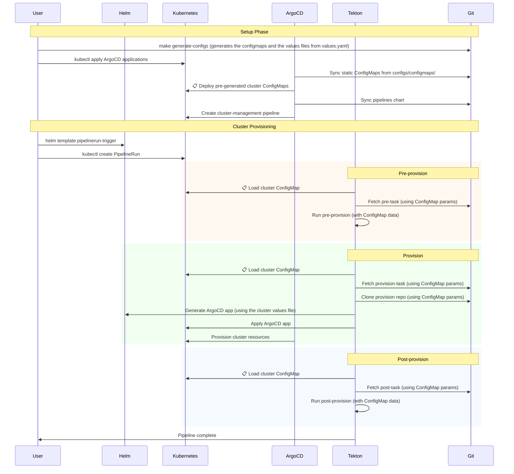

# Central Control Plane

A GitOps-based Kubernetes cluster management system that provides centralized provisioning and lifecycle management for multiple clusters across regions and sectors.

## Overview

The system centers around a `values.yaml` file that acts as the source of truth, containing cluster provisioning configurations with hierarchical inheritance (clusters → regions → sectors → defaults). A Python-based configuration generator pre-renders this into static cluster-specific ConfigMaps and values files, which are stored in Git. The Cluster Management pipeline then uses these ConfigMaps as input parameters, and helm charts can be applied using these values files.

The Cluster Management pipeline has three fully pluggable tasks: pre-provision, provision, and post-provision. Tasks are fetched from Git repositories at URLs and revisions specified in the configuration. When a task needs to apply resources to the cluster, such as the provision stage, it creates an ArgoCD application with a Helm chart that uses the same ConfigMap data to reconcile the desired cluster resources.

This architecture enables progressive delivery by allowing different task versions and configurations to be deployed across sectors, regions, and individual clusters while maintaining the ConfigMaps as the single source of truth that drives all pipeline execution.

Key features:

- **Pluggable pipeline tasks** for different cloud providers
- **Hierarchical configuration** with inheritance from clusters → regions → sectors → defaults
- **Progressive delivery** supported thanks to the hierarchical configuration
- **GitOps workflow** using ArgoCD for declarative cluster management
- **Cross-repository modularity** for pipeline tasks and provisioning templates

## Project Structure

```
.
├── values.yaml                                   # Main configuration file
├── configs/                                      # Generated configurations
│   ├── configmaps/                               # Static cluster ConfigMaps
│   └── values/                                   # Complete cluster configurations
├── tools/                                        # Configuration generation tooling
│   └── config-generator/                         # Python config generator
│       ├── generate_configs.py                   # Main generation script
│       ├── test_generate_configs.py              # Test suite
│       ├── pyproject.toml                        # Python project config
│       └── uv.lock                               # Dependency lock file
├── central-control-plane-applications/            # ArgoCD Applications
│   ├── central-control-plane-pipelines.application.yaml
│   └── cluster-configmaps.application.yaml        # Deploys static ConfigMaps
├── central-control-plane/                         # Core components
│   ├── pipelines/                                 # Tekton pipeline definitions
│   └── pipelinerun-trigger/                       # PipelineRun trigger chart
└── providers/                                     # Provider-specific implementations
    ├── aws/                                       # AWS provider
    │   ├── provision-application/                 # ArgoCD app for provisioning
    │   ├── provision/                             # Helm chart for AWS resources
    │   └── pipeline-tasks/                        # AWS-specific tasks
    │       ├── pre.yaml
    │       ├── provision.yaml
    │       └── post.yaml
    └── <other-providers>/                         # Additional providers
```

## Design



## Configuration System

### Configuration Sections

- `defaults`: Base configuration for all clusters
- `sectors`: sector-specific defaults
- `regions`: regional defaults (takes precedence over sectors) and **sector mapping**
- `clusters`: Individual cluster configurations (takes precedence over regions and sectors) and **region mapping**

The configuration follows a hierarchical inheritance model:

```
cluster config → region config → sector config → defaults
```

### Naming and Uniqueness Constraints

**Cluster Name Uniqueness**: Cluster names must be unique within each region, but the same cluster name can exist across different regions. This allows for consistent naming patterns while maintaining regional isolation.

For example, this is valid:
```yaml
clusters:
- name: cluster-01     # cluster-01 in us-east-1
  region: us-east-1
- name: cluster-02     # cluster-02 in us-east-1
  region: us-east-1
- name: cluster-01     # cluster-01 in eu-west-1 (same name, different region - OK)
  region: eu-west-1
```

But this would be invalid:
```yaml
clusters:
- name: cluster-01     # First cluster-01 in us-east-1
  region: us-east-1
- name: cluster-01     # Duplicate cluster-01 in us-east-1 - ERROR
  region: us-east-1
```

The configuration generator validates this constraint and will fail with a clear error message if violated.

### Example Configuration Structure

```yaml
defaults:
  tasks: ...
  data:
    WORKER_MACHINE_TYPE: "m5.xlarge"
    # ... other defaults

sectors:
- name: canary
  tasks: ...
  data:
    KUBERNETES_VERSION: "1.33"
    WORKER_MACHINE_COUNT: "2"
- name: prod-01
  tasks: ...
  data:
    KUBERNETES_VERSION: "1.29"
    WORKER_MACHINE_COUNT: "6"

regions:
- name: eu-west-1
  sector: canary
  tasks: ...
  data:
    REGION: "eu-west-1"

clusters:
- name: cluster-01
  region: eu-west-1
  tasks: ...
  data:
    ROLE_ARN: "arn:aws:iam::100000000001:role/central-control-plane"
```

## Getting Started

### Prerequisites

- `kind` - For local development cluster
- `kubectl` - Kubernetes CLI
- `helm` - Helm package manager

### Development Setup

1. **Create local cluster**:

    ```bash
    kind create cluster --name central-control-plane
    ```

2. **Install ArgoCD**:

   ```bash
   kubectl create namespace argocd
   kubectl apply -n argocd -f https://raw.githubusercontent.com/argoproj/argo-cd/stable/manifests/install.yaml
   ```

3. **Install Tekton**:

   ```bash
   kubectl create namespace tekton-pipelines
   kubectl apply --filename https://storage.googleapis.com/tekton-releases/pipeline/latest/release.yaml
   ```

4. **Install Tekton Dashboard** (optional):

   ```bash
   kubectl apply --filename https://storage.googleapis.com/tekton-releases/dashboard/latest/release-full.yaml
   ```

### Access Services

Set up port-forwarding for local access:

```bash
# ArgoCD UI
kubectl port-forward svc/argocd-server -n argocd 8080:443

# Tekton Dashboard
kubectl port-forward svc/tekton-dashboard -n tekton-pipelines 9097:9097
```

Get ArgoCD admin password:

```bash
kubectl get secret argocd-initial-admin-secret -n argocd -o jsonpath="{.data.password}" | base64 -d
```

## Usage

### 1. Configure Clusters

Edit `values.yaml` to define your clusters, regions, and sectors according to your infrastructure needs.

Generate cluster configurations:

```bash
make generate-configs
```

This creates static ConfigMaps in `configs/configmaps/` and complete cluster configurations in `configs/values/`.

### 2. Deploy Central Control Plane Applications

Install the ArgoCD applications that manage cluster configurations and pipelines:

```bash
kubectl apply -f central-control-plane-applications/
```

This creates:

- Static cluster ConfigMaps (deployed from `configs/configmaps/` directory)
- The cluster management pipeline

Verify installation:

```bash
# Check ConfigMaps (deployed to clusters namespace)
kubectl get configmaps -n clusters
NAME                               DATA   AGE
eu-west-1-cluster-01-config        15     4s
us-east-1-cluster-03-config        14     4s
us-east-1-cluster-04-config        14     4s
us-east-2-cluster-02-config        14     4s
...

# Check pipelines
kubectl get pipelines
NAME                 AGE
cluster-management   14s
```

### 3. Provision a Cluster

Trigger cluster provisioning using the PipelineRun trigger. You should use the values file for the cluster you want to provision.

```bash
helm template central-control-plane/pipelinerun-trigger \
    -f configs/values/eu-west-1-cluster-01-values.yaml | kubectl create -f -
```

You can disable specific pipeline stages:

```bash
# Skip post-provision tasks
helm template central-control-plane/pipelinerun-trigger \
  -f configs/values/eu-west-1-cluster-01-values.yaml \
  --set run-post=false | kubectl create -f -

# Run only pre-provision tasks
helm template central-control-plane/pipelinerun-trigger \
  -f configs/values/eu-west-1-cluster-01-values.yaml \
  --set run-provision=false \
  --set run-post=false | kubectl create -f -
```

NOTE: The recommended approach is commit the PipelineRun to the repository and apply it using a dedicated ArgoCD Application, as opposed to applying the PipelineRun directly. This enables PipelineRuns to follow the same GitOps workflow as the rest of the system.

### 4. Monitor Progress

Track pipeline execution:

```bash
# List PipelineRuns
kubectl get pipelineruns

# Get detailed status
kubectl describe pipelinerun <pipelinerun-name>

# Follow logs
kubectl logs -f <pod-name>
```

## Extending the System

### Adding New Providers

1. Create provider directory: `providers/<provider-name>/`
2. Implement the three required tasks:
   - `pipeline-tasks/pre.yaml`
   - `pipeline-tasks/provision.yaml`
   - `pipeline-tasks/post.yaml`
3. Create provision templates:
   - `provision-application/` - ArgoCD application chart
   - `provision/` - Provider-specific resource definitions
4. Update task references in `values.yaml`

NOTE: These tasks can be defined in an external repository.

### Customizing Pipeline Tasks

Tasks are dynamically loaded from Git repositories and can be customized at any level of the configuration hierarchy. The system supports:

- **Different repositories** for different environments or providers
- **Version pinning** using Git revisions for stability
- **Path customization** to organize tasks within repositories
- **Per-environment overrides** for progressive delivery

#### Task Configuration Parameters

Each cluster is managed through a three-stage pipeline:

- **Pre-provision**: Setup tasks before cluster creation
- **Provision**: Actual cluster provisioning using cloud-specific resources
- **Post-provision**: Configuration and validation after cluster creation

Each task stage (`pre`, `provision`, `post`) uses three parameters:

- `{stage}-task-git-url`: Git repository URL
- `{stage}-task-path`: Path to the task YAML file within the repository
- `{stage}-task-revision`: Git revision (branch, tag, or commit SHA)

These parameters should be defined in the `defaults` section of `values.yaml`, but can be overridden at the sector, region and cluster level.

This hierarchical task configuration enables fine-grained control over which task versions run in different environments while maintaining consistency where needed.

All tasks **MUST** be idempotent and can be selectively enabled/disabled.

## TODO

- ArgoCD Application to apply PipelineRuns
- `values.yaml` might become too large, how do we decompose it?
- read configmap once, and pass it to the tasks
